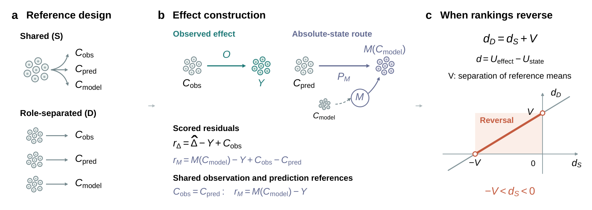

# How control cells enter a model comparison

A perturbation effect is measured relative to untreated cells. These control
cells can serve three purposes: a model may use them as input, their mean
expression may be subtracted from predicted expression to obtain a predicted
effect, and they provide the baseline for measuring the observed effect.

Refara's primary comparison, O, uses one control block for model inputs
and the baseline of a predicted treated state, and a separate block for the
observed effect. A direct-effect prediction `d` and its equivalent state
representation `C_model + d` receive the same O score: subtracting `C_model`
recovers `d`. This keeps the comparison consistent when the same prediction is
expressed in different forms.

For a given state prediction and observed expression, subtracting the same
control mean from both leaves their squared-error residual unchanged. Using
different control means can change the score and reverse a model comparison.
For the change from shared (S) to fully disjoint (D) references, panel c shows
the exact reversal condition under balanced, equal-depth assignments scored
before averaging: a direct-effect model with fixed predictions overtakes a
state-output model when its positive initial deficit is smaller than the mean
squared standardized separation between references. Panels a and b show the control
assignments and how they enter effect construction and scoring.

To compare different input controls, use predictions generated from each set of
cells. If only the scoring references change, you can reuse the model's output
and recalculate the effects and scores. The [operation guide](REFERENCE_AUDIT.md)
walks through these changes.

The three-block design in the figure is used to examine each control role
separately. [Choosing references](choosing-references.md) explains the available
designs and the assumptions behind the ranking comparison. Specify the roles,
budgets and sampling strata, then compare all declared allocations to identify
which conclusions are sensitive to these choices.
